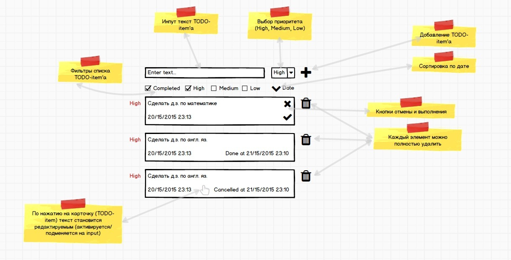

# Тестовое задание для стажеров

Реализация тестового задания подразумевает разработку клиентской части приложения
(Todo-листа) средствами JavaScript.

Перед выполнением тестового задания рекомендуем ознакомиться с частю 2, глава 1 "Документ", а также часть 3 главы 3 "Сетевые запросы"  учебника JavaScript (https://learn.javascript.ru).

## Логика работы приложения

## Запуск сервера
Для запуска сервера необходимо последоательно выполнить в коммандной строке комнады:
#### `install nodejs`
#### `npm i` (из директории проекта)
#### `node todo.js` (из директории проекта)

## Описание интерфейсов взаимодейстия с сервером (API)

### Получить все элементы
* GET http://127.0.0.1:3000/items

### Сохранить элемент
* POST http://127.0.0.1:3000/items
* id не указывается, а присваивается в процессе сохранения элемента и возвращается в теле ответа

### Обновить элемент
* PUT http://127.0.0.1:3000/items/:itemId

### Удалить элемент
* DELETE http://127.0.0.1:3000/items/:itemId
